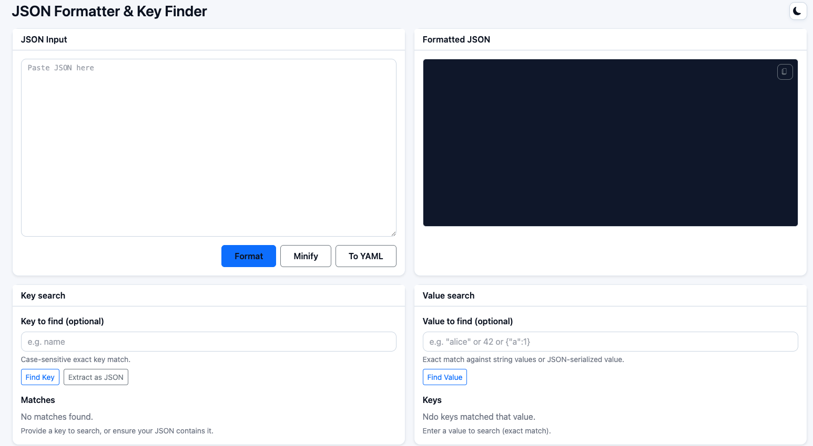
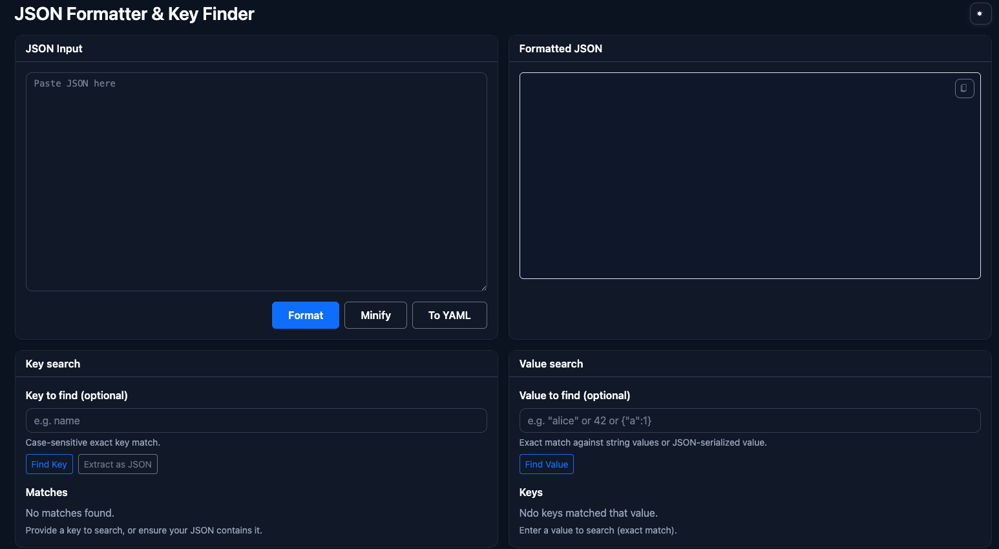

# JSON Formatter & Key Finder

A small Go + Gin web app that formats JSON, searches keys/values, minifies JSON, converts JSON to YAML, and extracts key/value pairs as JSON. Uses Go templates with a base layout and minimal inline styling.

## Features
- Format JSON with pretty-print.
- Minify JSON (compact).
- Search for values by key and keys by value.
- Extract a key and its value(s) as JSON.
- Convert JSON to YAML.
- Copy formatted output to clipboard.

It has dark and light themes:



## Hot reload (Air)
If you installed Air (configured via `.air.toml`):
```bash
air -c .air.toml
```

## Building cross-platform binaries
Using the provided Makefile from the project root:
```bash
make mac      # macOS amd64 and arm64 -> bin/json_formatter-darwin-*
make windows  # Windows amd64 -> bin/json_formatter-windows-amd64.exe
make all      # mac + windows
make clean    # remove bin/ and tmp/app
```
Binaries are written to `bin/`. Use the macOS arm64 binary for Apple Silicon and amd64 for Intel Macs.
